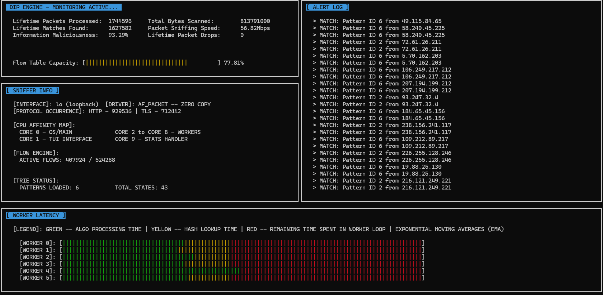

# Parallel-DPI-Engine

## Getting things to work 
### DEMO EXAMPLE
With all the correct calls, the TUI should look like this: 



### Getting Started 
Clone the repository and in the main directory perform: 
```
/Parallel-DPI-Engine$ make
/Parallel-DPI-Engine$ sudo ./sniffer lo text/patterns.txt 
```
_Ignore the meaning behind `lo` as it was part of a primitive version of this project and is no longer in use. The system is using loopback by default -- hardcoded. I just really wanted to get the project done with._

At this stage you will have the TUI displaying in the terminal in an idle state. Note that if the metrics aren't displayed properly, try resizing the terminal -- may take multiple tries. 

__Sending Packets__

To send packets to the program, ensure that `hping3` is downloaded and perform in another terminal: 
```
/Parallel-DPI-Engine$ sudo hping3 127.0.0.1 --rand-source -i u10 -d 500 --file ./text/trigger.txt
```

If you want to figure out what all these flags mean, I suggest looking at the [linux man pages](https://linux.die.net/man/8/hping3). Note that these packets do not have request headers specifying the L7 protocol, hence they will be shown as raw data. 

To send HTTP or TLS just add `http_` or `tls_` prefix to `trigger.txt` file, e.g: 
```
/Parallel-DPI-Engine$ sudo hping3 127.0.0.1 --rand-source -i u10 -d 500 --file ./text/http_trigger.txt
```
If you want to send packets with different L7 protocols to the same sniffer, just open a new terminal and run `hping3` with the desired text file input. 

__Customising Patterns and Triggers__ 
`patterns.txt` contains all the 'malicious' content the sniffer will be looking out for and the trigger files have the contents of what `hping3` will be sending in the packets to the sniffer. You can simply alter the files as you please, but take into account that each line contains a new 'word'. 

## Project Overview 
Stateful DPI Engine designed for high throughput. Leverages Linux-native zero copy primatives and DFA (Aho-Corasick's Algo)
for recognising patterns. How fast can this run???? 

This is a multi-threaded, stateful Deep Packet Inspection (DPI) engine written in C. Unlike standard firewalls that only inspect the network layer (L3) or the transport layer (L4), this inspects application layer (L7) protocols as a stream to identify malicious signatures. 

### Core Components 
- __Zero Copy:__ Uses linux `AF_PACKET` with `PACKET_MMAP` to create a shared-memory ring buffer between the kernel and the user space, avoiding the overhead of frequent heavy function calls like `recv()` and `memcpy()`. Overall, the number of CPU cycles per packet is heavily reduced. 
- __Stateful Flow Tracking:__ A 5-tuple (Source IP, Destination IP, Source Port, Destination Port, Protocol) hash table that allows the system to contain the 'context' of previous Deterministic Finite Automaton (DFA) states to ensure that if a split up packet non-contiguously, maliciousness will still be detected. 
- __Deterministic Pattern Matching:__ The Aho-Corasick DFA algorithm compiles signatures into keyword tries/tries with failure links. More information about how this works can be found [here](https://www.geeksforgeeks.org/dsa/aho-corasick-algorithm-in-python/). 
- __Concurrency and Thread Affinity:__ A multi-worker architecture where the Linux kernel balances traffic across the CPU cores using `PACKET_FANOUT_HASH` to distribute packets appropriately, to the correct workers. Each worker thread is also pinned to a specific CPU core as to improve cache hits and prevent context switching overhead. 
- __Text-Based User Interface (TUI):__ Displays all the metrics collected while the process is running in real-time as to make error detection easier and visualise components of the system. 

## State Saving 
Using hash values to map worker states to a flow table to ensure that every TCP that shares the same 5-tuple will be able to continue through the algo loop without external interference. Safety system: flow aging (30s) and flow nuking (60s) 

The engine's memory is built around a 5-tuple hash table to ensure thread safety and minimise non-deterministic memory overhead. The memory pool is a preallocated `flow_pool` to avoid frequent calls to `malloc()` as it is a non-deterministic function, i.e. time spent in the function varies dependent on available memory space and frequency in memory fragmentation. 

### Flow Entry Lifecycle 
_Quick note: A flow entry is a single stored struct inside the flow table. It contains information about the stored state of the Aho-Corasick algorithm and the last time the flow entry was used -- very important._

When a packet arrives, the engine calculates the a hash of it's 5-tuple using `hash_5tuple()` in `sniffer.c`. This acts as an index into the flow table. 
1. __Lookup:__ Engine traverses a linked list at the index (and also using `*next` for collision handling) to see if the flow already exists. 
2. __Acquisition:__ If the flow is new, then the engine 'pops' a preallocated flow entry from a stack linked to the next free index in the flow pool. 
3. __State Handoff:__ The `last_state` integer is retrieved from the flow entry and is used to position the Aho_corasick algorithm with respect to the previous packet. After the current packet is scanned, and the new DFA state is saved again, the loop is repeated. 

The flow pool links to the storage of the actual `flow_entry_t` to collect. The flow stack indicates the availability of flow pool indexes so that overwriting is safe. Flow table is the access point such that when given a hash value, it returns the memory address of the desired `flow_entry_t` in the flow pool. 

_CPU caching is more efficient when working with contiguous memory, hence the entire reason for the flow pool existing._ 

### Handling Concurrency and Collisions 
You would've noticed in step 1 earlier that `*next` is used for collision handling. In the case that two 5-tuples (with different inherent values) collision chaining is used to resolve the issue. It just means that when given one or more 5-tuples with the same hash value, they will combine to form a linked list that can be traversed. _If you're interested about better methods of collision management or maybe hashing in general, maybe have a look at my Custom-Hashing project on my github._ 

To maximise throughput, the system avoids the dreaded global lock, which would end up as a massive bottleneck. Instead, fine grained locking is used.

The `flow_locks[]` array contains multiple mutex locks distributed across the table that allows workers to work simultaneously. Take for example; worker A wants to update a flow at index 10, while worker B wants to update at index 100, they can do that at the same time. Remember that only one worker can hold a lock at a time, so if two workers were to try to update something, its first come first served to avoid race conditions. In addition to those locks, each `flow_entry_t` has its own internal lock to ensure that even if two packets from the same flow somehow hit different workers, the internal state of the Aho-Corasick DFA remains uncorrupted. _This feature was important in a primitive version of this program where `PACKET_FANOUT_HASH` was not in use and hence the same 5-tuple to could go to different workers as odd as it may sound. I never wanted to remove it as everything was working as expected without making those changes._ 

### Safety and Memory Sustainability 
To prevent the flow pool's preallocated slots from being exhausted in general, the engine uses flow aging. Tracking the `last_seen` timestamp will tell us how long it has been since the flow entry was last used, if it has taken too long (30 seconds), then the respective indices to the flow entry can be pushed back onto the `flow_free_stack` to show that they can be overwritten. This way, the engine can reuse same same memory space without having to use up increasingly more memory space. 
Sometimes the speed at which idle flow entries are 'killed' may take longer than the number of flow entries being created/taking up space, hence there is a safeguard for when the flow table reaches 90% capacity -- all flow entries that are 60 seconds old (or more) are 'killed'. 


## Data Plane and Ingress 

The data plane is the path the packet takes from the Network Interface Card (NIC) to the CPU. This engine uses a zero-copy pipeline to avoid expensive memory copies and context switches. 

### Zero-Copy Mechanism
The primative packet capture involved copying packets from the kernel space to the user space every time, resulting in super expensive sniffing speeds and a lot of wasted worker thread activity as the number of packets per second got larger. To bypass this issue, the engine uses 
- `PACKET_RX_RING`: Requests the Linux kernel to allocate a circular buffer in the kernel memory space. 
- `mmap()`: Map that exact kernel memory region directly into the engine's address space. 

As a result, the kernel writes packet data into a frame, and the worker threads read it from the same physical memory address. This eliminates the need for syscalls and reduces the CPU overhead of moving data. 

### Scalability
To take full advantage of multi-core CPUs, the engine employs Linus `FANOUT`. By configuring `PACKET_FANOUT_HASH`, the kernel performs a hardware accelerated 5-tuple hash on the NIC. Note that all packets belonging to the same specific TCP stream are guaranteed to be delivered to the same worker thread's ring buffer. And since a single worker handles a single flow, the flow entry data and the Aho-Corasick state remain 'hot' in the CPU core's cache lines, preventing cache line bouncing between multiple CPUs and/or cores. 

### Spacial vs Temporal Locality 
As stated before, the use of `FANOUT` ensures tha packets from the same flow are processed to the same worker (core) to ensure that the state of the DFAs are never accessed by multiple workers at once. But notice that the engine scans packets in the exact order in which they're delivered. This means that if the delivered TCP segments are out of chronological order, the sniffer will be unable to recognise malicious activity. For example 'CH' is chronologically supposed to come after 'MAT' according to the network, but instead 'CH' is received first. Here the DFA will traverse 'CHMAT', unable to find anything malicious even though the true packet is 'MATCH'. To resolve this, it is best to implement a intermediate buffer that reorders packets in accordance with temporal locality -- this will slow the entire sniffer down and may act as a new bottleneck but will ensure everything is found. 


## L7 Protocol Identification 
The engine ignores the port number but instead looks at the first 8-16 bytes of the TCP payload. By using memory-efficient comparisons like `memcmp`, it identifies protocols based on their immutable handshake signatures. The exact handshake signatures can be found in their respective trigger files in `/text`. 
- __HTTP:__ Scans for ASCII method verbs such as `GET`, `POST`, or `HTTP` version string at the start of the payload. 
- __TLS:__ Note that TLS handshake cannot be seen directly using a text file as it uses the hexadecimal sequence `0x16 0x03`, where `0x16` is the handshake type and `0x03` is the version. 

## Text-Based User Interface (TUI) 
Talk about how metrics are captures directly in the sniffer and then those metrics are displayed directly in the TUI to see. talk about each subsection of the TUI and what values actually mean, for example a higher than 100% maliciousness may mean that multiple malicious calls have been found in the same packet, take 'A' and 'MATCH', A is in MATCH. 

The engine's custom TUI is built using the `ncurses` library. Because the sniffer operates on multiple threads across the different CPU cores, TUI acts as an 'information hub' for all the metrics collected. 

### General Notes
- __Information Maliciousness:__ Can go above 100%. Sometimes the `patterns.txt` file may contain two patterns such that one is a substring of another. In this case, for each packet, two (or more) matches may be found. Also note that since L7 handshake headers are in their respective text files, the sniffer also reads those and as a result, maliciousness may not be 100% but slightly under -- given only one match is found per packet.
- __ALERT LOG:__ Displays information about the matches being found; the type and the location. 
- __WORKER LATENCY:__ Sometimes you may see that the hash lookup time is taking significantly longer to perform, for a split second -- indicated by a spike in yellow bars. This _may_ indicate a situation when iterating through the linked list for collision hash values as then the system transforms from a constant time search to a linear time search with respect to the number of collisions at that hash value. 


